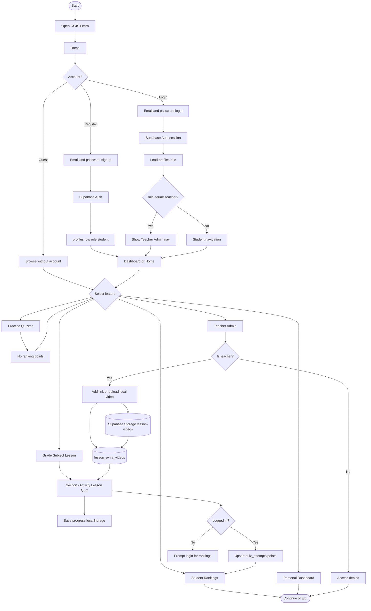
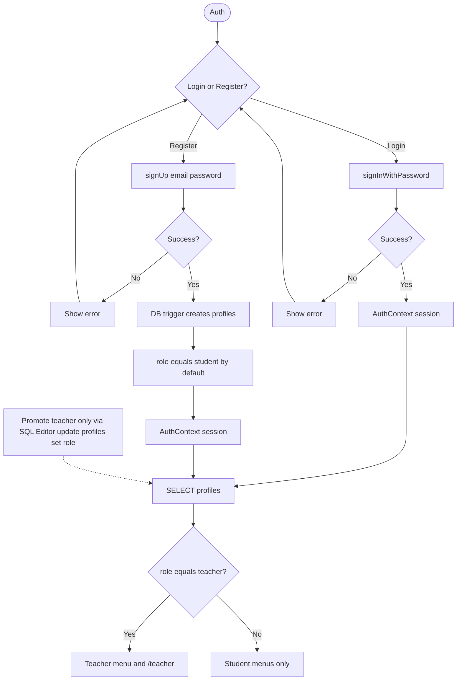
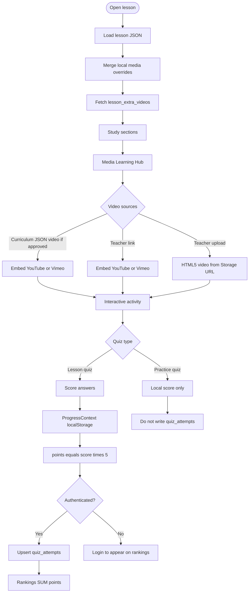
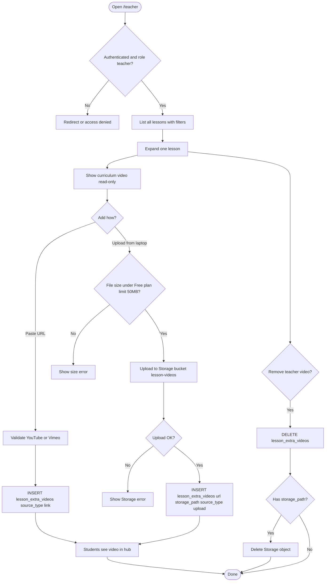
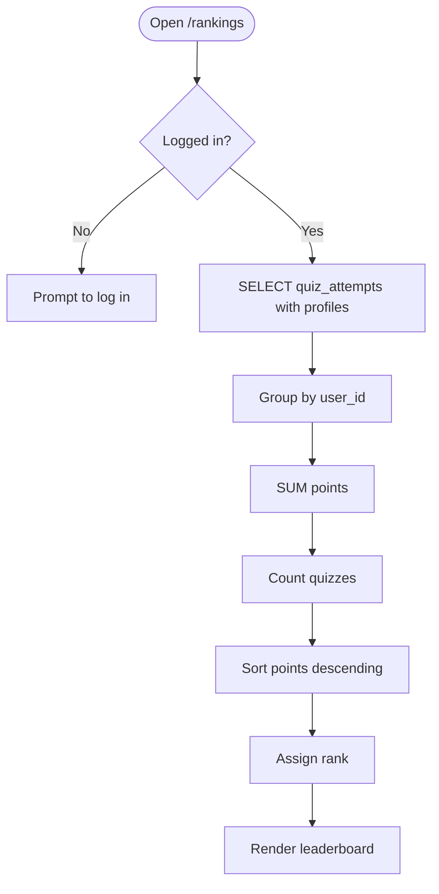
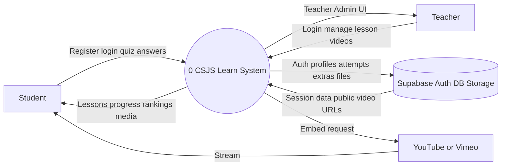
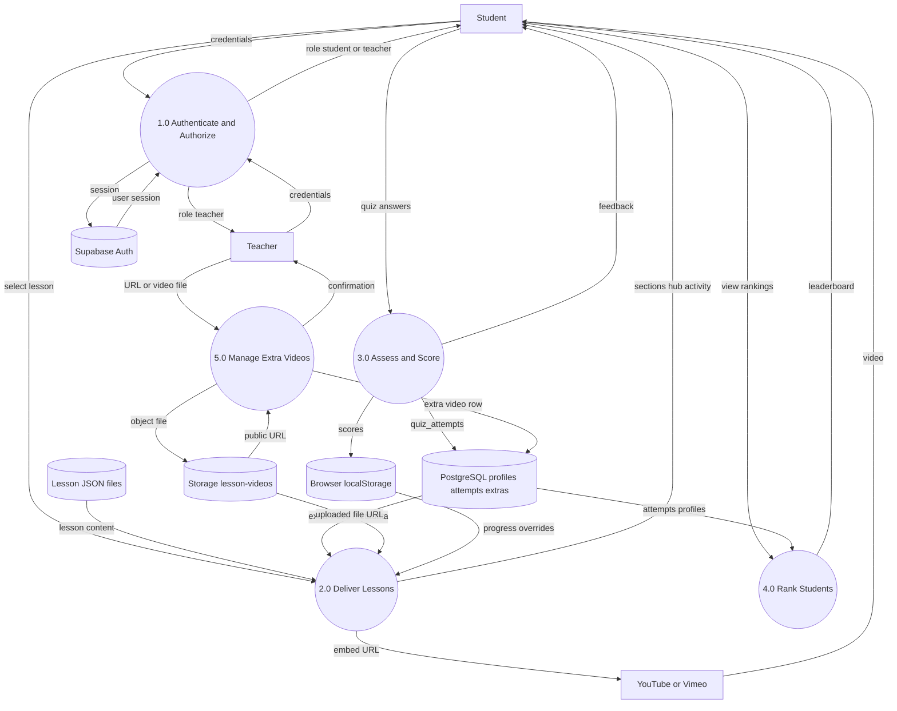
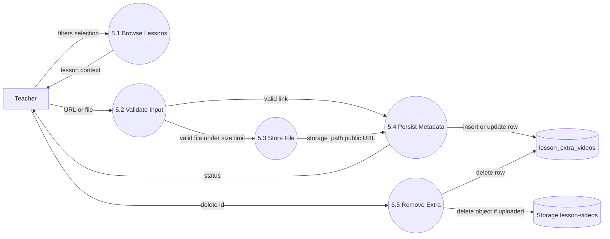
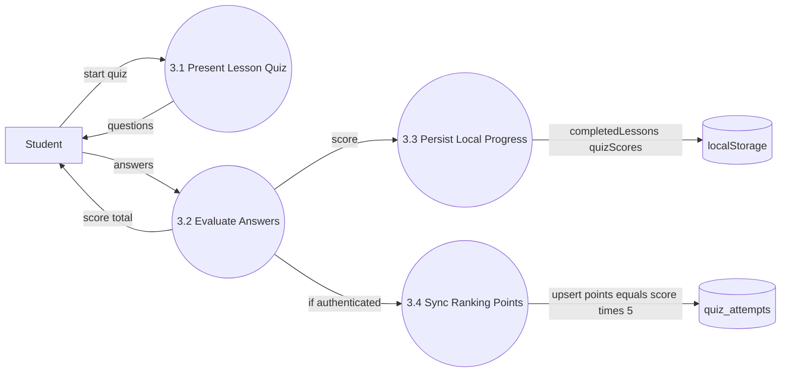

# CSJS Learn — System Flowcharts & Data Flow Diagrams (Revised)

**System:** Colegio de San Juan Samar Multimedia Animation Learning Platform  
**Document version:** 2.0 (revised after Supabase auth, rankings, and Teacher Admin)  
**Stack:** React (Vite) · Supabase Auth · PostgreSQL · Supabase Storage · JSON lessons · localStorage  

---

## 1. System overview flowchart

---

## 2. Authentication & role flowchart

---

## 3. Lesson learning, media & ranking flowchart

---

## 4. Teacher Admin — add / remove videos flowchart

---

## 5. Ranking aggregation flowchart

---

## 6. DFD — Level 0 (Context)

| External entity | Role |
|-----------------|------|
| **Student** | Learns, takes lesson quizzes, views rankings |
| **Teacher** | Manages additional lesson videos (link or upload) |
| **Supabase** | Auth, `profiles`, `quiz_attempts`, `lesson_extra_videos`, Storage |
| **YouTube / Vimeo** | External streaming for link-based videos |

---

## 7. DFD — Level 1 (Major processes)

### Level 1 process catalog

| ID | Process | Description |
|----|---------|-------------|
| **1.0** | Authenticate and Authorize | Register/login; load `profiles.role` (`student` / `teacher`) |
| **2.0** | Deliver Lessons | Serve JSON lessons; show curriculum + teacher videos in Media Hub |
| **3.0** | Assess and Score | Grade lesson quizzes; local progress; sync points when logged in |
| **4.0** | Rank Students | Aggregate `SUM(points)` from lesson quizzes only |
| **5.0** | Manage Extra Videos | Teacher adds/edits/removes links or uploaded files (JSON curriculum stays) |

### Data stores

| Store | Type | Contents |
|-------|------|----------|
| Lesson JSON | Bundled static | Grades, subjects, lessons, curriculum `video` |
| localStorage | Browser | Progress, optional media overrides |
| PostgreSQL | Supabase | `profiles`, `quiz_attempts`, `lesson_extra_videos` |
| Storage `lesson-videos` | Supabase | Teacher-uploaded video files (Free plan ≈ 50 MB max) |

---

## 8. DFD — Level 2 for Process 5.0 (Manage Extra Videos)

---

## 9. DFD — Level 2 for Process 3.0 (Assess and Score)

---

## 10. Data dictionary (revised)

| Data flow | From → To | Description |
|-----------|-----------|-------------|
| email, password | User → 1.0 | Credentials |
| role | profiles → 1.0 → UI | `student` or `teacher` |
| lesson content | JSON → 2.0 | Sections, activity, quiz, curriculum video |
| extra video metadata | DB → 2.0 | url, title, source_type, storage_path |
| uploaded file | Teacher → 5.3 → Storage | MP4/WebM/MOV (respect Free plan 50 MB) |
| public video URL | Storage → 2.0 → Student | HTML5 `<video>` playback |
| quiz answers | Student → 3.0 | Lesson quiz selections |
| points | 3.4 → quiz_attempts | `score × 5` per lesson (best kept) |
| leaderboard | 4.0 → Student | Rank, name, quizzes, total points |

---

## 11. Notes for documentation / thesis

1. **Practice quizzes do not enter Process 4.0** (Rank Students).  
2. **Curriculum videos** live in static JSON and are not deleted by Teacher Admin.  
3. **Teacher extras** are additive: link (`source_type = link`) or upload (`source_type = upload`).  
4. **Supabase Free plan** enforces a **50 MB** global upload limit — larger files must use external links.  
5. Guests may study and quiz locally; ranking sync requires authentication.  
6. Export diagrams via [Mermaid Live Editor](https://mermaid.live) for Word/PDF figures.
